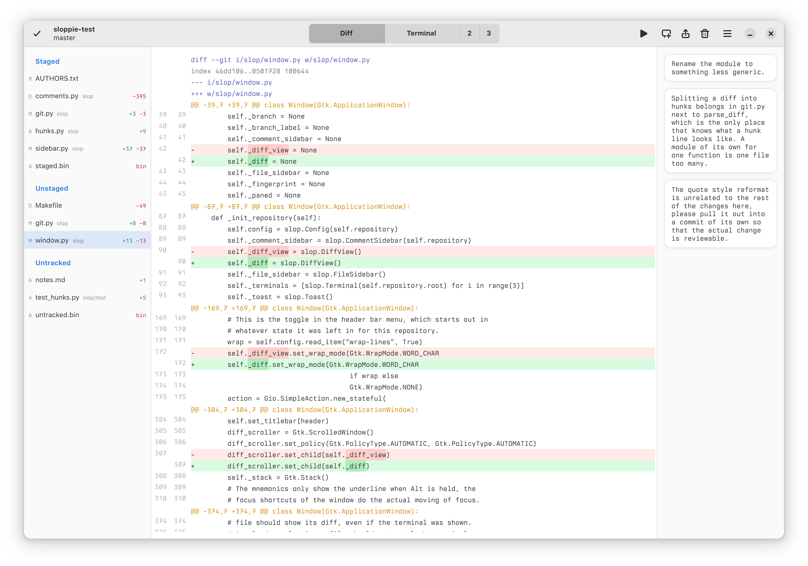
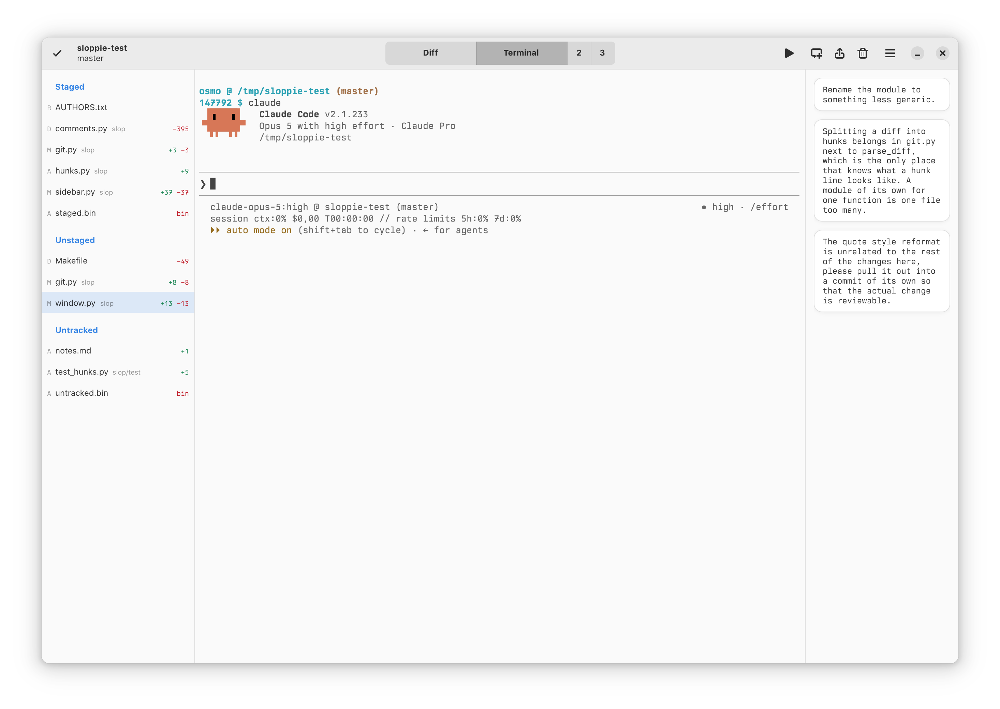
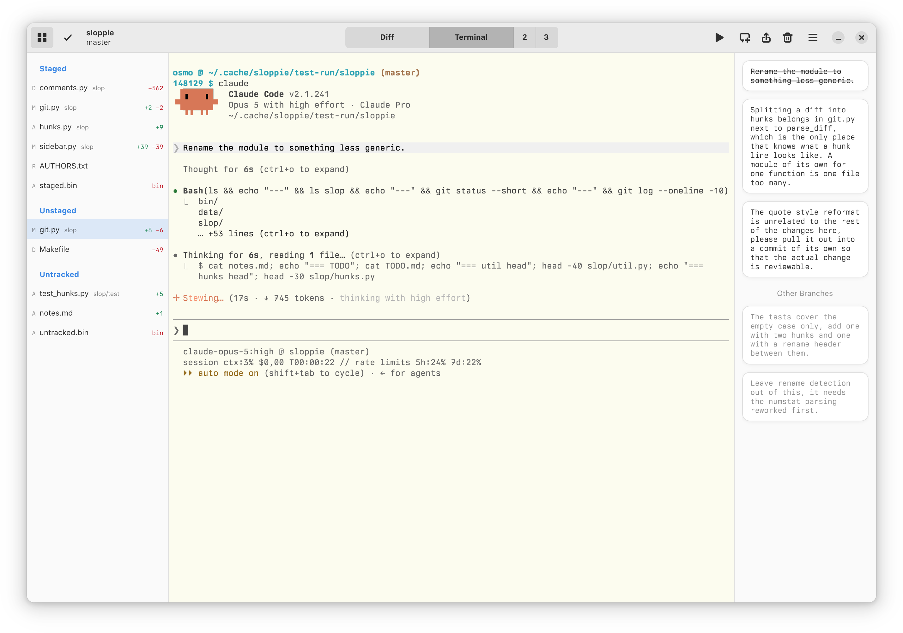

# Sloppie

Sloppie is a development environment that provides a dashboard to
orchestrate work over multiple parallel tasks, each of which features a
coding agent running in a terminal, a git diff viewer and a
code-review-like mechanism to pass comments on the diff async to the
coding agent. Sloppie runs on Linux, fitting best in the GNOME desktop.





## How Sloppie Differs

- **Review comments as the interface.** You write comments on hunks of
  the diff, as you would in a code review, and send them to the agent
  when you're ready. They are saved per branch under `.git/sloppie` and
  live until an agent has handled them. Most tools in this space stop at
  showing you the diff to merge or discard.

- **Copies, not worktrees.** A subtask is a plain `cp -a` of the
  repository. Worktrees are the conventional choice, but the disk space
  they save is irrelevant next to `node_modules` or `venv` etc. and a
  copy is faster to make, faster to delete and has no shared `.git` to
  reason about. In modern agentic coding, branches are short-lived and
  independent and don't benefit from the `.git` sharing.

- **Terminals, not agent panes.** Each task has three real terminals
  running your shell in the task's directory. The agent is only a
  command you run in one of them, and everything else you'd do at a
  shell still works.

- **Full pages, not split views.** The dashboard and each task are pages
  shown one at a time. While you work on a task, nothing on screen
  concerns the other tasks: no list of them along the side, no counters
  ticking in a corner. A task that needs your input says so through a
  desktop notification and a dot on the dashboard button.

- **Native GTK.** Not Electron, not a browser in a window. Linux and
  GNOME are the only target rather than a third port.

- **Small enough to make your own.** No accounts, no telemetry, no
  cloud, no subscription and no licence that can change under you.
  Sloppie is some 4000 lines of Python, which is little enough that a
  coding agent can take in the whole of it and rework it to suit you:
  from fonts and colors to how the thing behaves.

## Installing

Sloppie is hard-coded to its author's preferences and not generic or
configurable. If you like the concept and want to use Sloppie, instead
of installing and using it directly, you'd likely want to clone the
repository, ask a coding agent to customize the font, colors, editor
etc. to your preferences and use that clone instead.

Sloppie requires Git, Python ≥3.10, PyGObject ≥3.42, GTK 4.x,
GtkSourceView 5.x and VTE ≥0.76. On Debian/Ubuntu you can install the
dependencies with the following command.

    sudo apt install gir1.2-gtk-4.0 \
                     gir1.2-gtksource-5 \
                     gir1.2-vte-3.91 \
                     git \
                     make \
                     python3 \
                     python3-gi

Then, to install Sloppie, run command

    sudo make PREFIX=/usr/local install

## Notifications

Sloppie sends a desktop notification when something in a task warrants
attention: an agent done with its turn or a long command finished. This
is accomplished via the terminal bell: the coding agent rings the bell,
Sloppie hears that and shows the notification. An example notification
hook script below for Claude Code, file `~/.claude/notify.sh`, configure
in `~/.claude/settings.json`.

```bash
#!/bin/bash
if [ -n "$SLOPPIE" ]; then
    # Ring the bell for Sloppie.
    printf '\a' > "${SLOPPIE_TTY:-/dev/tty}" 2>/dev/null
    exit 0
else
    notify-send -i claude -e "Claude Code" "Wants something"
fi
```
